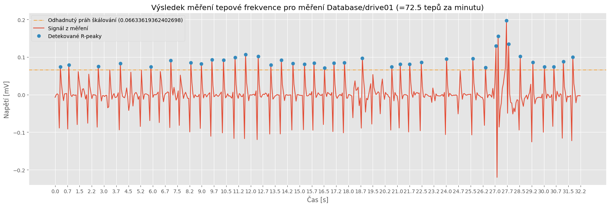
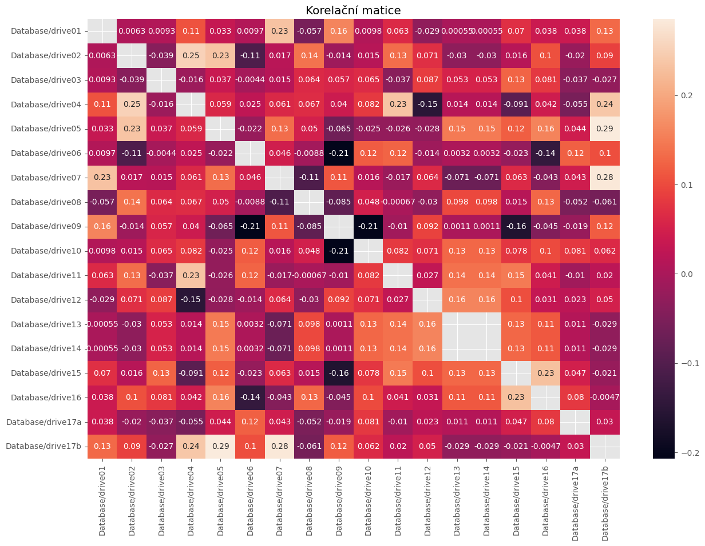
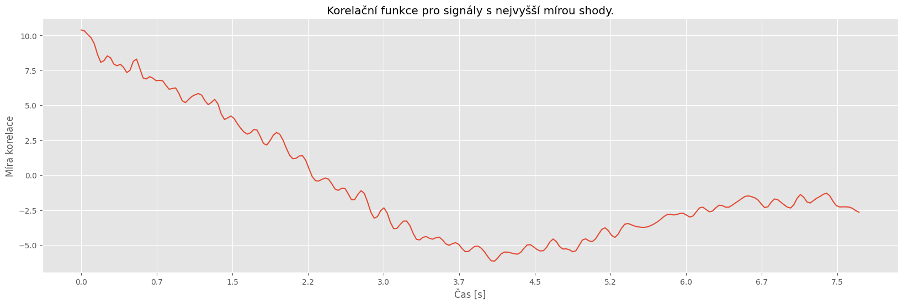
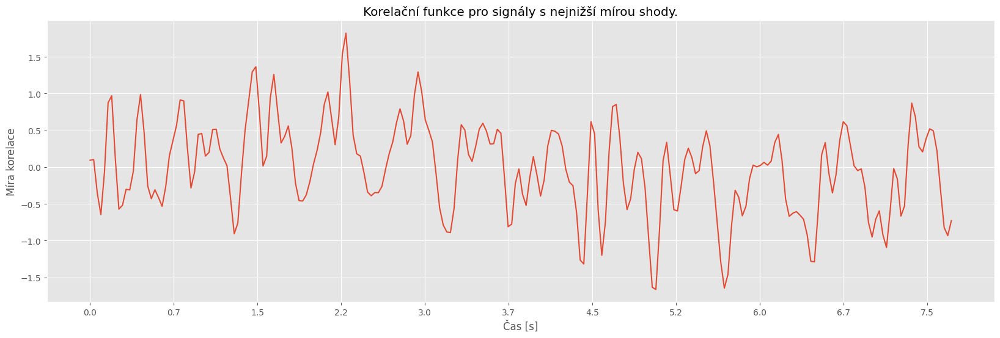
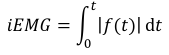
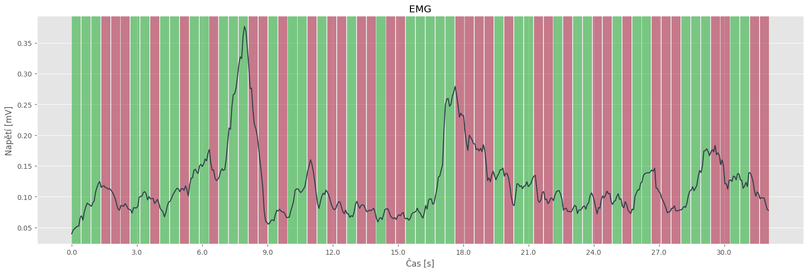

# I. seminární práce z předmětu Počítačové zpracování signálu (KI/PZS)
- Jakub Jelínek
- 23.01.2024
- [Jupyter notebook](S1.ipynb)
- [Zadání](SeminarniPrace-I.pdf)
## Výpočet tepové frekvence z EKG signálu
### Zadání
Ve zdrojové databázi najdete celkem 17 měření EKG signálu. Signál je již filtrován a centralizován kolem podélné osy. EKG signál obsahuje dominantní peaky, které se nazývají R vrcholy. Vzdálenost těchto vrcholů určuje dobu mezi jednotlivými tepy. Počet tepů za minutu je tedy počet R vrcholů v signálu o délce jedné minuty. Navrhněte algoritmus, který bude automaticky detekovat počet R vrcholů v EKG signálech a prezentujte tepovou frekvenci při jednotlivých jízdách/měřeních. Vás algoritmus následně otestujte na databázi MIT-BIH https://physionet.org/content/nsrdb/1.0.0/ a prezentujte jeho úspěšnost vzhledem k anotovaným datům z databáze.
### Řešení
Nejprve je signál zarovnán podél osy x pomocí high-pass filtru, dále je odhadnut práh pro detekci R-peaků pomocí N-tého percentilu `numpy.percentile(sig, percentile)`. Poslední krok je potom nalézt hodnoty, které jejichž hodnotou přesahují dříve stanovený práh. Algoritmus je vytvořený tak, že po každém R-peaku musí signál spadnout pod prahovou hodnotu aby mohl hledat další.
### Grafický výstup

Testování algoritmu na databázi MIT-BIH. Při měření úspěšnosti není brán ohled na peaky, které jsou změřeny navíc.
```
nsrdb\16265: úspěšnost: 87.472 %, D správně: 1152, D špatně: 759, Správně celkem: 1317, D celkem: 1911
nsrdb\16272: úspěšnost: 84.654 %, D správně: 844, D špatně: 1583, Správně celkem: 997, D celkem: 2427
nsrdb\16273: úspěšnost: 81.014 %, D správně: 1007, D špatně: 882, Správně celkem: 1243, D celkem: 1889
nsrdb\16420: úspěšnost: 78.769 %, D správně: 909, D špatně: 947, Správně celkem: 1154, D celkem: 1856
nsrdb\16483: úspěšnost: 79.419 %, D správně: 930, D špatně: 1362, Správně celkem: 1171, D celkem: 2292
nsrdb\16539: úspěšnost: 94.612 %, D správně: 1036, D špatně: 1151, Správně celkem: 1095, D celkem: 2187
nsrdb\16773: úspěšnost: 59.382 %, D správně: 826, D špatně: 914, Správně celkem: 1391, D celkem: 1740
nsrdb\16786: úspěšnost: 78.216 %, D správně: 754, D špatně: 1066, Správně celkem: 964, D celkem: 1820
nsrdb\16795: úspěšnost: 71.766 %, D správně: 760, D špatně: 1080, Správně celkem: 1059, D celkem: 1840
nsrdb\17052: úspěšnost: 78.712 %, D správně: 880, D špatně: 728, Správně celkem: 1118, D celkem: 1608
nsrdb\17453: úspěšnost: 90.232 %, D správně: 933, D špatně: 1379, Správně celkem: 1034, D celkem: 2312
nsrdb\18177: úspěšnost: 83.255 %, D správně: 1243, D špatně: 705, Správně celkem: 1493, D celkem: 1948
nsrdb\18184: úspěšnost: 79.767 %, D správně: 958, D špatně: 1412, Správně celkem: 1201, D celkem: 2370
nsrdb\19088: úspěšnost: 74.511 %, D správně: 1029, D špatně: 670, Správně celkem: 1381, D celkem: 1699
nsrdb\19090: úspěšnost: 90.070 %, D správně: 1034, D špatně: 724, Správně celkem: 1148, D celkem: 1758
nsrdb\19093: úspěšnost: 80.229 %, D správně: 771, D špatně: 938, Správně celkem: 961, D celkem: 1709
nsrdb\19140: úspěšnost: 78.860 %, D správně: 996, D špatně: 901, Správně celkem: 1263, D celkem: 1897
nsrdb\19830: úspěšnost: 89.747 %, D správně: 1278, D špatně: 780, Správně celkem: 1424, D celkem: 2058
Půměrná úspěšnost: 81.149 %
```
### Závěr
Úspěšnost algoritmu závisí na zvolené percentilu a na zvolené frekvenci filtru, pro tyto účely byla zvolena hodnota 92, ale určitě nelze toto číslo považovat jako magické číslo pro jiné měření a signály může fungovat lépe nebo hůře. Určitě by algoritmus by mohl být vylepšen detekováním celé vlny a zajistit tak vyšší přesnost.
## Výpočet korelace EKG signálů
### Zadání
Ve zdrojové databázi najdete celkem 17 měření obsahující EKG signál. Signály jsou již filtrované a centralizované kolem podélné osy. Různá měření jsou získána s různou vzorkovací frekvencí. U všech signálů analyzujte vzorkovací frekvenci a proveďte sjednocení na tu dominantní z nich. Pro tyto převzorkované signály proveďte korelační analýzu a prezentujte, jak jsou si signály napříč měřeními podobné. Pro smysluplné provedení této analýzy je potřeba nejprve srovnat signály na stejný počátek, např. dle pozice prvního dominantního R peaku. Protože se délky jednotlivých signálů neshodují, je také nutné zvolit vhodnou délku korelační funkce, a to například analýzou autokorelačních funkcí samostatných signálů.
### Řešení
Signál je nejprve převeden na dominantní frekvenci ze všech signálů databáze. Dále je potřeba odstranit počáteční část signálů až po první nalezený R-peak, jinak by korelace neměla smysl. Korelační koeficienty pak vypočítáme pomocí funkce numpy `numpy.corrcoef(sigs)`, heatmapu `seaborn.heatmap(cor_matrix, annot=True)` a jako poslední vytvoříme korelační funkce pomocí `scipy.signal.correlate(s1, s2, mode="same")`.
### Grafický výstup

```
Lowest value in correlation matrix: 0.0005511970034773568
Corresponding labels: ('Database/drive01', 'Database/drive13')

Highest value in correlation matrix: 0.2852113485316801
Corresponding labels: ('Database/drive05', 'Database/drive17b')
```


### Závěr
Celkově lze konstatovat, že provedená analýza poskytla ucelený pohled na korelaci mezi EKG signály v databázi. Identifikovali jsme podobnosti a rozdíly mezi jednotlivými měřeními. Pro správnou funkci a ukazatelnost je určitě potřeba použít vhodný algoritmus na hledání prvního R-peaku
## Výpočet korelace EKG signálů
### Zadání
Ve zdrojové databázi najdete celkem 17 měření EMG signálu. Signál je již filtrován a centralizován kolem podélné osy. EMG signály zachycují aktivitu svalů během jízdy. Pro všech 17 měření spočítejte integrované EMG (iEMG) pomocí vzorce\
\
kde, t je doba záznamu,  je EMG signál a  symbolizuje absolutní hodnotu. Dále detekujte oblasti, kde u jednotlivých signálů dochází k nárůstu a poklesu aktivity, a to pomocí okénkové varianty iEMG a derivace funkce. Velikost okénka zvolte tak, aby byly výsledky statisticky spolehlivé.
### Řešení
Kód nejprve aplikuje rektifikaci na vstupní EMG signál tím, že převede všechny hodnoty na jejich absolutní hodnoty. Následně provádí integraci signálu pomocí okénkové metody s využitím funkce `numpy.convolve(sig, np.ones(window_size), mode="same")`. Tímto způsobem jsou získány hodnoty integrovaného EMG, které mohou být použity k další analýze a detekci oblastí změn aktivity v EMG signálu.
### Grafický výstup

Hodnoty pro iEMG signálu jsou potom získány jako `round(np.sum(rectify(sig)), 3)`
```
Database/drive01 iEMG: 3.896
Database/drive02 iEMG: 824.877
Database/drive03 iEMG: 539.356
Database/drive04 iEMG: 9291.2
Database/drive05 iEMG: 145.136
Database/drive06 iEMG: 142.203
Database/drive07 iEMG: 30.065
Database/drive08 iEMG: 127.498
Database/drive09 iEMG: 205.335
Database/drive10 iEMG: 153.72
Database/drive11 iEMG: 143.12
Database/drive12 iEMG: 125.404
Database/drive13 iEMG: 486.635
Database/drive14 iEMG: 486.635
Database/drive15 iEMG: 230.405
Database/drive16 iEMG: 218.171
Database/drive17a iEMG: 102.151
Database/drive17b iEMG: 127.089
```
### Závěr
Celkově lze konstatovat, že provedená analýza poskytuje užitečné informace o dynamice svalové aktivity během jízdy a umožňuje identifikaci specifických oblastí změn aktivity. Přesnost algoritmu závisí na zvolené prahové hodnotě zde byla použita `threshold=0.001` a velikosti okna, zde byla použita hodnota vzorkovací frekvence signálu

### Použité zdroje
- https://numpy.org/doc/
- https://docs.scipy.org/doc/scipy/
- https://matplotlib.org/3.5.3/api/_as_gen/matplotlib.pyplot.html
- https://wfdb.readthedocs.io/en/latest/
- https://seaborn.pydata.org/