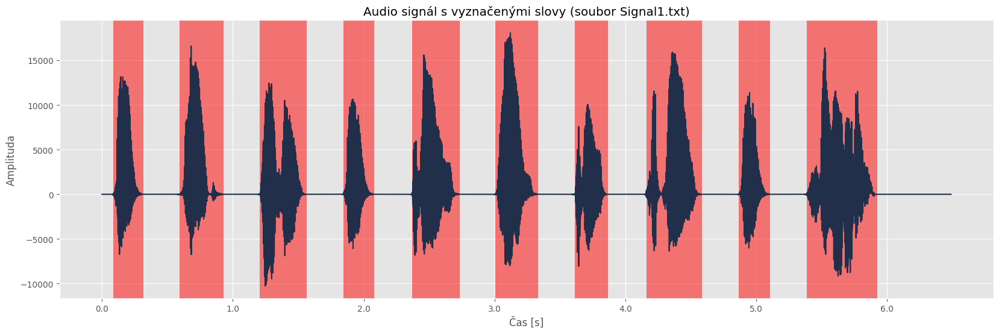
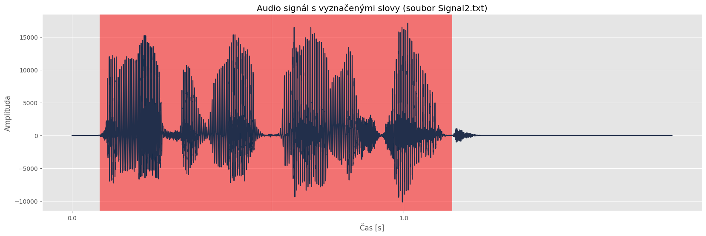
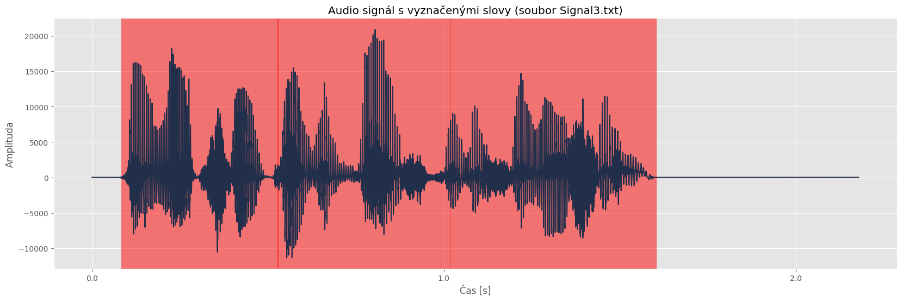

# II. seminární práce z předmětu Počítačové zpracování signálu (KI/PZS)
- Jakub Jelínek
- 23.01.2024
- [Jupyter notebook](S2.ipynb)
- [Zadání](SeminarniPrace-II.pdf)
## Detekce a přiřazení slov v záznamu řeči
### Zadání
Ve zdrojovém souboru *Signal1.txt* a na Obrázku 1 najdete záznam řeči převedený na signál,
resp. časovou řadu. Pomocí metod analýzy signálu v časové oblasti, frekvenční oblasti nebo
jejich kombinací identifikujte jednotlivá slova v záznamu. Vybírejte z následujícího seznamu
slov:
```
time, prepare, solution, make, mistake, no, the, probable, long, lecture, method, disaster, fail,
work, advice, idea, succeed, easy, is, for, give
```
Vámi navržený algoritmus vyzkoušejte na záznamech *Signal2.txt* a *Signal3.txt* a identifikujte
slova i v těchto dvou časových řadách. V případě potřeby algoritmus dále vylepšete. Kromě
metod probraných při hodinách lze pro identifikaci jednotlivých slov využít například některé
další funkce, například Hammingova funkce nebo Hilbertova transformace, případně jakoukoli
další metodu, kterou uznáte za vhodnou, vyjma metod založených na strojovém učení.
Vzorkovací frekvence signálu je ve všech případech 22050 Hz.
### Řešení
Než začneme pracovat s poskytnutým signálem je nutno si vygenerovat *.wav* soubory jednotlivých slov a nahrajeme si je do vektorů.

Začínáme odsekáním prázdných úseků nahrávky na začátku a konci s využitím prahové hodnoty pro úroveň ticha. Následně rozdělujeme nahrávku na jednotlivá slova, identifikujeme pauzy a tím získáváme části nahrávky obsahující jedno slovo. Pro každou z těchto částí nahrávky extrahujeme audio charakteristiky, zejména MFCC a centroidy.
```
sY = librosa.feature.melspectrogram(y=y, sr=sr, n_fft=n_fft)
mfccsY = librosa.feature.mfcc(S=librosa.power_to_db(sY))
scY = librosa.feature.spectral_centroid(y=y, n_fft=n_fft)
chromaY = librosa.feature.chroma_stft(y=y, sr=sr, n_fft=n_fft)
```
Provádíme porovnání těchto charakteristik s databází slov, využíváme metriky, jako je cosine similarity nebo directed Hausdorff distance.
```
scipy.spatial.distance.directed_hausdorff(featureX, featureY)
```
Na základě výsledků sestavujeme seznam potenciálních slov v databázi. Z tohoto seznamu vybíráme slovo s nejmenším rozdílem od aktuální části nahrávky. Celkově tedy náš algoritmus kombinuje odsekání, rozdělení, extrakci charakteristik a porovnání s databází, což nám umožňuje identifikovat slova s podobnými vlastnostmi v nahrávce. Implementace samozřejmě závisí na dostupných knihovnách pro extrakci charakteristik a porovnání. Výstupem máme potom graf signálu a pod tím máme pro jednotlivé části odhadnutá slova (*3*) podle výše zmíněných charakteristik. Hodnoty jsou uvedeny v %.
### Výstup pro *Signal1.txt*

```
('the', 80.8) ('no', 29.2) ('easy', 18.7)
('work', 66.9) ('make', 35.1) ('no', 17.7)
('easy', 85.0) ('idea', 25.2) ('make', 20.6)
('the', 67.0) ('no', 31.7) ('long', 18.7)
('time', 63.9) ('give', 23.9) ('easy', 23.6)
('no', 41.7) ('work', 28.4) ('make', 24.5)
('the', 38.9) ('no', 27.0) ('time', 26.9)
('long', 31.9) ('idea', 31.0) ('prepare', 27.4)
('the', 66.5) ('no', 33.9) ('long', 18.0)
('solution', 36.6) ('for', 27.8) ('fail', 27.3)
```
### Výstup pro *Signal2.txt*

```
('probable', 31.6) ('prepare', 30.7) ('idea', 28.0)
('disaster', 40.7) ('prepare', 26.5) ('give', 26.5)
```
### Výstup pro *Signal3.txt*

```
('prepare', 32.3) ('method', 29.4) ('idea', 28.6)
('advice', 36.8) ('prepare', 27.5) ('method', 27.4)
('easy', 33.9) ('idea', 28.9) ('method', 27.8)
```
### Závěr
Celkově lze konstatovat, že navržený algoritmus pro porovnávání částí záznamu řeči s databází slov, využívající MFCC a dalších charakteristik, prokázal schopnost účinně identifikovat slova na základě podobnosti jejich akustických vlastností. Tímto způsobem lze dosáhnout úspěšného rozpoznávání slov v hovořících záznamech. Implementace algoritmu závisí na dostupných nástrojích a knihovnách, a jeho úspěch závisí na kvalitě a diverzitě databáze slov. Algoritmus zjevně obstál při prvním záznamu, kde jsou slova jednoznačně oddělena, ale očekávaně nedostačuje v dalších záznamech, kde nelze jednodušše odhadnout začátek a konec slova, v praxi jsou tyto algoritmy nahrazeny strojovým učením, popřípadě umělé inteligence.

### Použité zdroje
- https://numpy.org/doc/
- https://librosa.org/doc/latest/index.html
- https://matplotlib.org/3.5.3/api/_as_gen/matplotlib.pyplot.html
- https://pyttsx3.readthedocs.io/en/latest/